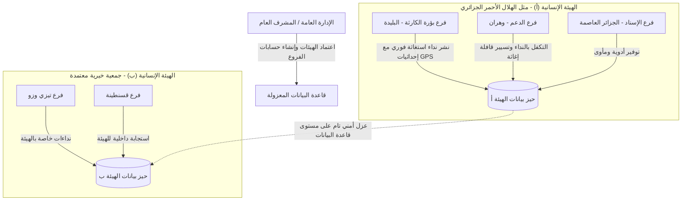

<div align="center">

# 🇩🇿 الجمهورية الجزائرية الديمقراطية الشعبية
### المنظومة الرقمية الوطنية لتنسيق الإغاثة والاستجابة الإنسانية في حالات الكوارث
## National Emergency Relief & Humanitarian Aid Coordination Platform (HopeLink DZ)

[](https://donations-algeria.web.app)
[](https://donations-algeria.web.app)
[](https://donations-algeria.web.app)
[](https://donations-algeria.web.app)

<br/>

**المنصة الرقمية المركزية لإدارة الأزمات وتنسيق الدعم اللوجستي وتسيير قوافل المساعدات بين الفروع الإقليمية للهيئات والجمعيات الإنسانية المعتمدة عبر التراب الوطني.**

[🌐 البوابة الرقمية المباشرة (Live Portal)](https://donations-algeria.web.app) • [📋 دليل التشغيل المؤسساتي](#-دليل-التشغيل-والاستخدام-المؤسساتي) • [🔒 ميثاق الأمان والحوكمة](#-بنية-الأمان-وحوكمة-البيانات)

---

</div>

<br/>

## 📌 الملخص التنفيذي (Executive Summary)

تم تصميم وتطوير هذه المنظومة الرقمية كأداة سيادية متطورة موجهة للهيئات الإنسانية المعتمدة (مثل **الهلال الأحمر الجزائري**، **الجمعيات الخيرية والإغاثية الوطنية**، والجهات التنسيقية المختصة) لإدارة الاستجابة العاجلة في حالات الكوارث الطبيعية والأزمات الميدانية (حرائق الغابات، الفيضانات، الزلازل، موجات البرد القارس، وغيرها).

تعالج المنظومة الإشكاليات الاستراتيجية الكبرى التي تواجه العمل الإغاثي التقليدي:
1. **القضاء على العشوائية وتشتت المساعدات**: التنسيق الدقيق يمنع تكديس مواد معينة في منطقة وتجاوز مناطق أخرى أكثر تضرراً.
2. **الربط الشبكي اللحظي بين الفروع**: تمكين الفرع المتواجد في بؤرة الكارثة من رفع الاحتياجات الميدانية بدقة، لتقوم الفروع الأخرى في الولايات المجاورة بتجهيز القوافل وتوجيهها فوراً.
3. **التوثيق اللوجستي لمسار القوافل**: تتبع تدفق المعونات من لحظة التعهد والإرسال حتى الاستلام الميداني والتأكيد.

---

## 🏛️ الركائز المعمارية والوظيفية للمنظومة



---

### 1. 🛡️ العزل المؤسساتي والأمني المتعدد (Intra-Charity Data Isolation)
- **خصوصية العمل الإغاثي**: تعمل كل جمعية أو منظمة إنسانية داخل **فضاء رقمي محمي ومستقل تماماً (Cryptographic Data Enclave)**.
- **الحماية على مستوى النواة (Backend Enforcement)**: لا تقتصر الحماية على واجهة المستخدم، بل تفرض قواعد الحماية المركزية في قاعدة البيانات (`Cloud Firestore Security Rules`) منع أي فرع من الاطلاع على نداءات أو تحركات فروع تابعة لجمعية أخرى، ما يضمن الانضباط المؤسساتي وحماية المعطيات التشغيلية.

---

### 2. ⚡ سجل النداءات الميدانية فائق السرعة (Real-Time Relief Operations Feed)
- **واجهة عملياتية ميدانية مبسطة**: تم استبدال القوائم المعقدة بتدفق عملي سريع مصمم للاستخدام تحت الضغط الميداني.
- **تصنيف فوري للاحتياجات**:
  - 🍱 **المواد الغذائية والوجبات الجاهزة**
  - 🧥 **الألبسة والأفرشة والبطانيات**
  - 💊 **الأدوية والمستلزمات الطبية والإسعافات**
  - ⛺ **خيام الإيواء وتجهيزات الطوارئ**
  - 📦 **المعدات اللوجستية المتنوعة**
- **محددات الاستعجال الوطنية**: (🔴 حالة حرجة وطارئة • 🟡 استجابة خلال أيام • 🟢 دعم مستمر).
- **التواصل المباشر الآمن**: زر اتصال مباشر بنقرة واحدة لربط منسقي الفروع دون وسائط.

---

### 3. 🗺️ نظام الرصد والتموضع الجغرافي الوطني (GIS Disaster Mapping across 58 Wilayas)
- تغطية شاملة لكافة ولايات الوطن (58 ولاية).
- تحديد دقيق للمواقع الجغرافية بنظام التموضع العالمي (GPS Coordinates).
- خريطة تفاعلية تعرض بؤر التدخل وأماكن تواجد الفروع ومسارات الدعم اللوجستي مع مؤشرات لونية تدل على درجة الخطورة.

---

### 4. 🚚 إدارة قوافل الدعم والتعهدات اللوجستية (Dispatch & Convoy Logistics Engine)
- **نظام التكفل التكاملي**: إمكانية التكفل الكلي بالطلب من فرع واحد، أو التكفل الجزئي وتوزيع العبء على عدة فروع (مثال: الفرع (أ) يوفر 30% والفرع (ب) يوفر 70%).
- **بطاقة التحرك اللوجستي**: تسجيل بيانات وسيلة النقل، رقم اللوحة، هاتف السائق، والتوقيت التقديري لوصول القافلة.
- **تأكيد الاستلام الميداني**: إغلاق دائرة الطلب بمجرد وصول المعونة وتأكيد المنسق المستلم.

---

### 5. 🏢 لوحة القيادة والرقابة المركزية (Super-Admin Governance Hub)
- اعتماد الجمعيات والمنظمات الإنسانية الوطنية بضغطة زر.
- إنشاء الفروع الإقليمية وتوليد بيانات الاعتماد وحسابات الدخول المؤسساتية المشفرة.
- توثيق البريد الإلكتروني الرسمي وأرقام هواتف التنسيق لكل فرع.
- مراقبة مؤشرات التدخل وسرعة الاستجابة الإغاثية عبر المستوى الوطني.

---

## 🔒 بنية الأمان وحوكمة البيانات (Enterprise Security Architecture)

| الجانب الأمني | المعيار المعتمد | الآلية التنفيذية |
| :--- | :--- | :--- |
| **التوثيق وتحديد الهوية** | Firebase Identity Management | تشفير كامل لكلمات المرور، دعم أسماء الدخول والبريد الرسمي المؤسساتي. |
| **التحكم بالصلاحيات (RBAC)** | Role-Based Access Control | فصل محكم بين صلاحيات المشرف العام (`Super Admin`) ومنسقي الفروع (`Branch Member`). |
| **أمان قاعدة البيانات** | Cloud Firestore Security Rules v2 | تدقيق إلزامي لكل استعلام بحيث يطابق `orgId` للمستخدم، ورفض أي محاولة اختراق على مستوى الخادم. |
| **تشفير الاتصال** | TLS 1.3 & HTTPS | تشفير جميع حزم البيانات المتبادلة بين الميدان والخوادم المركزية. |
| **حماية الجلسات الإدارية** | Dual-Instance Auth Engine | عزل إنشاء حسابات الفروع في بيئة ثانوية لمنع انقطاع أو تسريب جلسة المشرف العام. |

---

## 💻 المكونات البرمجية والتقنية (Technology Stack)

- **الواجهة الأمامية (Frontend)**:
  - React 18 (مكتبة الواجهات المعيارية للتطبيقات التفاعلية عالية الأداء)
  - Vite Engine (بناء فائق السرعة محسّن للإنتاج)
  - Tailwind CSS Enterprise Framework (تصميم عصري متجاوب بالكامل مع أجهزة الهواتف اللوحية وشاشات غرف العمليات)
  - Lucide Icons & Responsive Design System
- **نظام الخرائط والتموضع (GIS & Geolocation)**:
  - Leaflet Engine & React-Leaflet
  - OpenStreetMap Cartography Layer
- **الخوادم وقواعد البيانات (Backend & Cloud)**:
  - Google Cloud Firestore (قاعدة بيانات سحابية موزعة بزمن استجابة لحظي Real-Time Listeners)
  - Firebase Authentication (إدارة الهويات والأمان)
  - Firebase Global CDN Hosting (شبكة توزيع محتوى عالية التوفر بمعدل 99.95% Uptime)

---

## 📋 دليل التشغيل والاستخدام المؤسساتي

### 1. الدخول للمنظومة
- يتم الولوج عبر الرابط المؤسساتي المعتمد.
- إدخال اسم المستخدم / البريد المؤسساتي وكلمة المرور الممنوحة من الإدارة المركزية.

### 2. اعتماد جمعية جديدة وتعيين فروعها (من قبل المشرف العام)
1. الانتقال إلى **لوحة الإشراف (`/admin`)**.
2. في تبويب **"1. الجمعيات"**: النقر على **"إضافة جمعية جديدة"** وإدخال الاسم الرسمي (مثل: *الهلال الأحمر الجزائري*).
3. في تبويب **"2. الفروع والحسابات"**: النقر على **"إضافة فرع وتعيين حساب الدخول"**:
   - اختيار الجمعية التابع لها.
   - إدخال اسم الفرع والولاية المعنية.
   - إدخال البريد الرسمي ورقم الهاتف.
   - تحديد اسم المستخدم وكلمة المرور للدخول، ثم النقر على حفظ.
4. تسليم بيانات الدخول لمنسق الفرع الإقليمي.

### 3. إطلاق نداء استغاثة من فرع متضرر
1. من لوحة قيادة الفرع، النقر على زر **"+ طلب مساعدة"**.
2. تحديد نوع الاحتياج (غذاء، أدوية، مأوى، إلخ)، الكمية، درجة الاستعجال، والموقع الجغرافي بدقة (يدوياً أو عبر زر التموضع التلقائي GPS).
3. النقر على **"نشر النداء للمنظومة"** — يظهر فوراً لكافة فروع نفس الهيئة عبر الوطن.

### 4. التكفل بالنداء من قبل الفروع المساندة
1. يتلقى الفرع المساند النداء في شريط العمليات الميداني.
2. النقر على النداء للاطلاع على كامل التفاصيل، أو الاتصال بالمنسق بضغطة زر.
3. النقر على **"التكفل وتأكيد إرسال المعونة"** وتحديد نوع التكفل (كلي / جزئي) وتوقيت انطلاق القافلة.

---

## 🛠️ دليل الإعداد والتطوير المحلي (Technical Setup)

```bash
# 1. استنساخ المستودع البرمجي
git clone <repository_url>
cd Donations

# 2. تثبيت الحزم والمكتبات المعتمدة
npm install

# 3. تشغيل بيئة التطوير المحلية
npm run dev

# 4. بناء نسخة الإنتاج المعتمدة
npm run build
```

---

## 📜 الجاهزية والامتثال الحكومي (Government Handover Readiness)

- ✅ **الكود المصدري**: مهيكل وموثق بالكامل وفق المعايير البرمجية الحديثة، خالٍ من أي بيانات اعتماد مضمنة في الشيفرة (Zero Hardcoded Credentials).
- ✅ **القابلية للتوسع (Scalability)**: تدعم البنية استيعاب آلاف الفروع وعشرات الآلاف من العمليات اللوجستية دون تأثر في الأداء.
- ✅ **السيادة الرقمية والمرونة**: إمكانية الربط مع منصات الإخطار الحكومية والأنظمة المركزية لوزارة التضامن الوطني والحماية المدنية عبر واجهات برمجية معيارية (REST / Cloud Webhooks).

<br/>

<div align="center">

**تم إعداد وتجهيز هذه المنظومة بأعلى معايير الجودة التقنية لخدمة الوطن والمواطن وإغاثة المتضررين بكفاءة واحترافية.**

</div>
